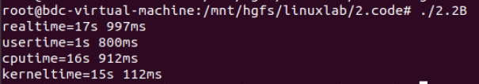
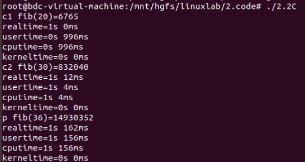
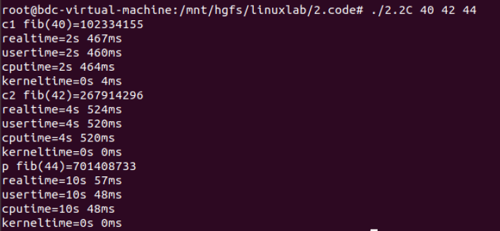

[TOC]

## 2.1 观察linux行为

> 学习linux内核、进程、存储和其他资源的一些重要特性。通过使用/proc文件系统接口, 编写一个程序检查反映机器平衡负载、进程资源利用率方面的各种内核值, 学会使用/proc文件系统这种内核状态检查机制。

### 实验目的

学习linux内核、进程、存储和其他资源的一些重要特性。通过使用/proc文件系统接口, 编写一个程序检查反映机器平衡负载、进程资源利用率方面的各种内核值, 学会使用/proc文件系统这种内核状态检查机制。

### 实验内容

编写一个默认版本的程序通过检查内核状态报告Linux内核行为。程序应该在stdout上打印以下值：

1，CPU类型和型号；

2，所使用的Linux内核版本；

3，从系统最后一次启动以来已经经历了多长时间（天，小时和分钟）；

4，总共有多少CPU时间执行在用户态，系统态，空闲态；

5，配置内存数量；当前可用内存数，磁盘读写请求数；

6，内核上下文转换数；

7，系统启动到目前创建了多少进程。

### 实验原理

#### /proc目录

/proc文件系统是一个伪文件系统，只存在内存当中，不占用外存空间，以文件系统的方式为访问**系统内核数据的操作提供接口**

/proc下有三个重要目录：net、scsi、sys。sys可写，可以通过它来访问或修改内核的参数、net和scsi依赖于内核配置。

还有一些以数字命名的目录，他们是进程目录，系统中当前运行的每个进程都有一个对应目录在/proc下，以pid为目录名，他们是**读取进程信息的接口**

而self目录则是**读取进程本身的信息接口**，是一个link


#### 部分子文件

| /proc/cpuinfo | cpu的信息                                                    |
| :------------ | ------------------------------------------------------------ |
| /proc/loadavg | 根据过去一段时间内cpu和io状态得出的负载状态，与uptime命令有关 |
| /proc/stat    | 所有的cpu活动信息                                            |
| /proc/uptime  | 系统已经运行了多久                                           |
| /proc/meminfo | 系统足的空闲内存和已用内存，以及内核所使用的共享内存和缓冲区，以字节为单位 |
| /proc/version | 系统运行的内核版本号，gcc版本                                |

* /cpuinfo

  查看cpuinfo<code>cat cpuinfo</code>

  

  

  

  部分含义：

  | processor   | 逻辑处理器的id #显示了4组（只截图了0、1）       |
  | ----------- | ----------------------------------------------- |
  | physical id | 物理封装的处理器id #有0、1 说明有2个物理处理器  |
  | core id     | 每个核心的id #分别有0 1 两个核心                |
  | cpu cores   | 位于相同物理封装的处理器中的内核数量 #2         |
  | siblings    | 位于相同物理封装的处理器中的逻辑处理器的数量 #2 |
  | model name  | cpu的类型、型号、主频                           |

  **所以这台主机的cpu为2个物理封装的处理器，每个处理器有2个处理核心，一共4个逻辑处理器**

* /loadavg

  

  **分别表示在过去的1、5、15分钟内运行队列中的平均进程数量、正在运行的进程数(分母是进程总数)、最近运行的进程的id号**

* /stat


cpu以及cpu0、cpu1、cpu2、cpu3每行的参数含义为：

|            | 时间(jiffies,1jiffies=0.01s) | 系统启动开始累积到当前时刻的... |
| ---------- | ---------------------------- | ------------------------------- |
| user       | 68302                        | 用户态的cpu时间                 |
| nice       | 4305                         | nice用户态的cpu时间             |
| system     | 75062                        | 处于内核态的cpu时间             |
| idle       | 3103962                      | 空闲时间                        |
| iowait     | 14632                        | 硬盘IO等待时间                  |
| irq        | 0                            | 硬中断时间                      |
| softirq    | 19973                        | 软中断时间                      |
| steal      | 0                            | 被盗时间                        |
| guest      | 0                            | 来宾时间                        |
| guest_nice | 0                            | 漂亮的来宾时间                  |

cpu总使用时间$total=user+system+nice+idle+iowait+irq+softirq$

采样两个足够短的时间间隔的cpu快照

那么CPU利用率$cpu \ usage=100-(idle2-idle1)/(total_2 - total_1)*100$

| ctxt      | 给出了自系统启动以来CPU发生的上下文交换的次数。           |
| --------- | --------------------------------------------------------- |
| processes | 自系统启动以来所创建的进程的个数目                        |
| intr      | 第一个数字是总的中断数目，之后就是分别的中断数目，从0开始 |

* /uptime


第一列为系统启动到现在的时间t1(s为单位)

第二列为系统启动大限制空闲的时间t2(s为单位)

系统的空闲率为t2/(t1*4)  #4为本机逻辑处理器个数

* /meminfo

  部分内容


| MemTotal     | 可用的总内存         |
| ------------ | -------------------- |
| MemFree      | 完全未用到的物理内存 |
| MemAvailable | 可用内存             |

* /version


linux版本 5.0.0-31-generic 

####  总结

对于本次实验：

通过cpuinfo获得cpu类型和型号

通过version获得linux内核版本

通过uptime获得最后一次启动以来经历时间

通过stat()获得用户态、系统态、空闲态时间、磁盘读写请求次数、上下文转换数、创建了多少进程

通过meminfo获得配置内存数量，当前可用内存数

###  程序设计

语言：python3

#### 输入输出

在命令行运行该程序，无参数时默认输出实验要求1~7的所有内容，可选参数有c、v、u、s、m

* c-------cpu类型、型号、主频
* v-------linux内核版本
* u-------最后一次启动以来经历的时间
* s-------用户态、系统态、空闲态时间，磁盘读写请求次数、上下文转换次数、创建进程数
* m------内存情况

#### 示例

1.<code>python3 2.1.py</code>


2.<code>python3 2.1.py cuv</code>


3.<code>python3 2.1.py.cuva</code> 含有错误参数


## 2.2 内核定时器

### 实验目的

学习掌握内核定时器的实现原理和方法，建立一种用户空间机制来测量多线程程序的执行时间。

### 实验内容

A.用定时器**ITIMER_REAL**实现**gettimeofday**的功能。使其一秒钟产生一个信号，

B.记录一个进程运行时所占用的**real time, cpu time,user time ,kernel time**

计算已经过的秒数。

C.编写一个主程序产生两个子进程，分别递归计算**N =20，30，36**的**Fibonacci**序列。分别对三个进程计算相应的**real time, cpu time,user time ,kernel time**

### 实验原理

#### 间隔定时器

一.系统调用<code>setitimer()</code>创建一个间隔式定时器，这种定时器会在未来每个时间点到期，并于此后每隔一段时间到期一次。

````c
#include <sys/time.h>

int setitimer(int which,const struct itimerav *new_value,struct itimerval *odd_value);
````

1.参数<code>which</code>指定以下值，进程可以创建三种不同类型的定时器

* ITIMER_REAL

  创建以真实时间倒计时的定时器。到期会产生**SIGALARM**信号并发送给进程

* ITMER_VIRTUAL

  创建以进程虚拟时间倒计时的定时器，到期会产生**SIGVTALRM**信号

* ITEMER_PROF

  创建一个profiling定时器，以进程时间倒计时，到期会产生**SIGPROF信号**

2.参数new_value和old_value均指向结构为<code>itimerval</code>的指针，结构定义如下：

````c
struct itimerval{
	struct timeval it_interval; //指定间隔时间
	struct timeval it_value;	//指定初始定时时间
}
//如果it_interval为0，那么定时器就属于在it_value所指定的时间间隔后到期的一次性定时器
//如果it_interval不为0，那么每次定时器到期后，都会将定时器重置为在指定间隔后再次到期

struct timeval{
	time_t	tv_sec; //秒
	suseconds_t tv_usec; //微秒
}
````

old_value用来保存先前的值，常为NULL

计时器会从初始值(it_value)倒计时直到0为止，递减为0时，会将信号发送给进程，随后如果时间间隔值(it_interval)非0，那么会再次将it_value加载至定时器，重新向0开始倒计时

二.可在任何时刻调用<code>getitimer()</code>,以了解定时器的当前状态、距离下次到期的剩余时间

````c
#include <sys/time.h>
int getitimer(int which,struct itimerval *curr_value)l
````

系统调用<code>getitimer()</code>返回which指定定时器的当前状态，并置于由<code>curr_value</code>所指向的缓冲区中，

<code>curr_value.it_value</code>返回距离下一次到期所剩余的时间

<code>curr_value.it_interval</code>返回定时器的时间间隔

#### signal()

位于<code><signal.h></code>中

````c
void (*signal(int sig,void(* handler)(int)))(int);
//sig 要处理的信号 *hanlder 信号处理方式
````

#### 创建子进程fork()

系统调用fork()创建一新进程(child),几近于对调用进程(parent)的翻版

````c
#include<unistd.h>
pid_t fork(void);
````

* 对其调用后将存在两个进程，这两个进程将执行相同的程序文本段，却各自拥有不同的栈段、数据段以及堆段拷贝。子进程的栈、数据以及栈段开始时是对父进程相应部分的完全复制，执行fork()后，每个进程均可修改各自的数据不互相影响
* 可通过fork()的返回值区分父、子进程，父进程中，fork()将返回新创建的子进程的进程ID，而fork()在子进程中返回0。
* 无法创建子进程时，fork()将返回-1

#### 等待子进程wait()

系统调用wait()等待调用进程的任一子进程终止，同时在参数status所指向的缓冲区中返回该子进程的终止状态

```c
#include <sys/wait.h>
pid_t waoit(int *status);
```

系统调用wait()执行以下操作：

* 如果调用进程并无之前未被等待的子进程终止，调用将一直阻塞直到某个子进程终止。

  如果调用时已有子进程终止，wait()则立即返回。

* 如果status非空，那么关于子进程如何终止的信息会通过status指向的整型变量返回

* 内核将会为父进程下使用子进程的运行总量追加进程cpu时间以及资源使用数据

* 终止子进程的ID作为返回值

* 出错时wait()返回-1

### 程序设计

#### Part A

>用定时器<code>ITIMER_REAL</code>实现<code>gettimeofday</code>的功能。使其一秒钟产生一个信号，计算已经过的秒数。

##### 设计思路

设置一个<code>ITIMER_REAL</code>计时器，时间间隔为$1s$，为信号<code>SIGALRM</code>设定处理程序<code>myhandle</code>使其输出秒数

#### Part B

>记录一个进程运行时所占用的**real time, cpu time,user time ,kernel time**

##### 设计思路

1.设置<code>ITIMER_REAL</code>计时器、<code>ITIMER_VIRTUAL</code>计时器、<code>ITIMER_PROF</code>计时器，设置时间间隔为10s，为信号<code>SIGALRM、SIGVTALRM、SIGPRROF</code>设定处理程序<code>myhandle</code>，使得每次计时器向进程发送信号后，相应的时间变量加10。

2.执行一段简单的双层循环语句

3.通过<code>getitimer</code>函数获得语句执行结束后各个计时器的状态，将其存放在<code>real_t、vir_t、prof_t</code>中。

4.经过数学运算得出<code>realtime、cputime、usertime、kerneltime</code>

##### 运行示例



#### Part C

>编写一个主程序产生两个子进程，分别递归计算**N =20，30，36**的**Fibonacci**序列。分别对三个进程计算相应的**real time, cpu time,user time ,kernel time**

##### 设计思路

与Part B的原理基本相同，只是在<code>fibonacci</code>开始前设定好每个进程的定时器并在输出结果后将实验结果打印出来

##### 运行实例

1.$N=20,30,36$



2.$N=40,42,44$




## 2.3内核模块

## 2.4 系统调用

