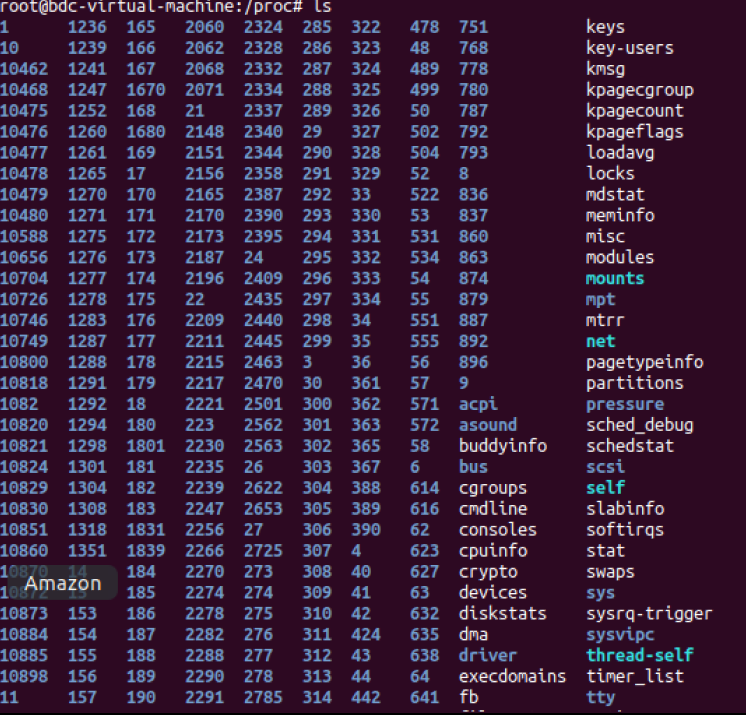
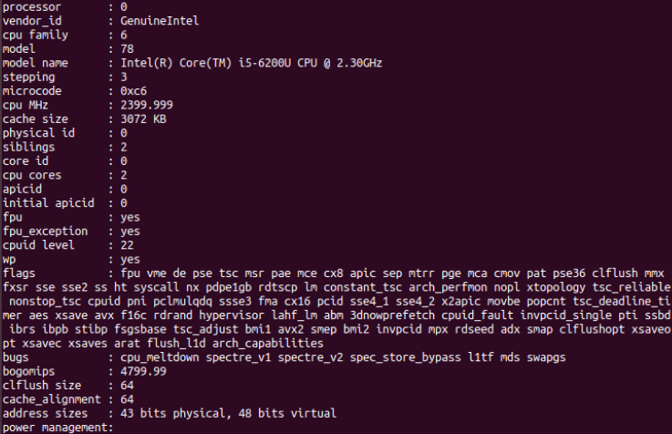
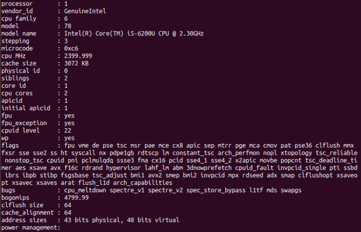
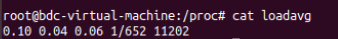
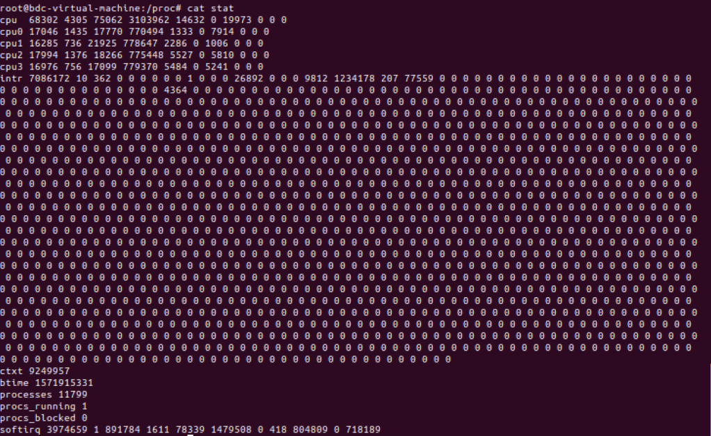
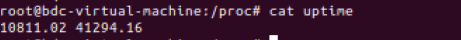
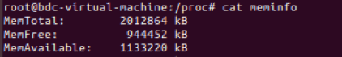
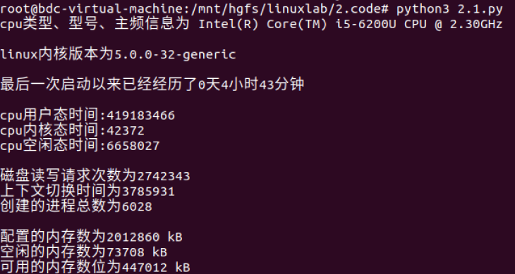
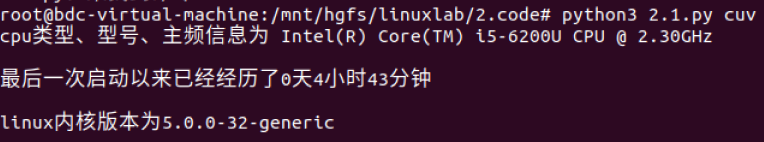
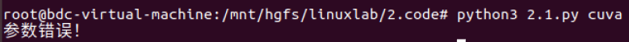

[TOC]

## 2.1 观察linux行为

> 学习linux内核、进程、存储和其他资源的一些重要特性。通过使用/proc文件系统接口, 编写一个程序检查反映机器平衡负载、进程资源利用率方面的各种内核值, 学会使用/proc文件系统这种内核状态检查机制。

### 实验目的

学习linux内核、进程、存储和其他资源的一些重要特性。通过使用/proc文件系统接口, 编写一个程序检查反映机器平衡负载、进程资源利用率方面的各种内核值, 学会使用/proc文件系统这种内核状态检查机制。

### 实验内容

编写一个默认版本的程序通过检查内核状态报告Linux内核行为。程序应该在stdout上打印以下值：

1，CPU类型和型号；

2，所使用的Linux内核版本；

3，从系统最后一次启动以来已经经历了多长时间（天，小时和分钟）；

4，总共有多少CPU时间执行在用户态，系统态，空闲态；

5，配置内存数量；当前可用内存数，磁盘读写请求数；

6，内核上下文转换数；

7，系统启动到目前创建了多少进程。

### 学习proc文件系统

#### /proc目录

/proc文件系统是一个伪文件系统，只存在内存当中，不占用外存空间，以文件系统的方式为访问**系统内核数据的操作提供接口**

/proc下有三个重要目录：net、scsi、sys。sys可写，可以通过它来访问或修改内核的参数、net和scsi依赖于内核配置。

还有一些以数字命名的目录，他们是进程目录，系统中当前运行的每个进程都有一个对应目录在/proc下，以pid为目录名，他们是**读取进程信息的接口**

而self目录则是**读取进程本身的信息接口**，是一个link

#### 部分子文件

| /proc/cpuinfo | cpu的信息                                                    |
| :------------ | ------------------------------------------------------------ |
| /proc/loadavg | 根据过去一段时间内cpu和io状态得出的负载状态，与uptime命令有关 |
| /proc/stat    | 所有的cpu活动信息                                            |
| /proc/uptime  | 系统已经运行了多久                                           |
| /proc/meminfo | 系统足的空闲内存和已用内存，以及内核所使用的共享内存和缓冲区，以字节为单位 |
| /proc/version | 系统运行的内核版本号，gcc版本                                |

* /cpuinfo

  查看cpuinfo<code>cat cpuinfo</code>

  

  

  

  部分含义：

  | processor   | 逻辑处理器的id #显示了4组（只截图了0、1）       |
  | ----------- | ----------------------------------------------- |
  | physical id | 物理封装的处理器id #有0、1 说明有2个物理处理器  |
  | core id     | 每个核心的id #分别有0 1 两个核心                |
  | cpu cores   | 位于相同物理封装的处理器中的内核数量 #2         |
  | siblings    | 位于相同物理封装的处理器中的逻辑处理器的数量 #2 |
  | model name  | cpu的类型、型号、主频                           |

  **所以这台主机的cpu为2个物理封装的处理器，每个处理器有2个处理核心，一共4个逻辑处理器**

* /loadavg

  

  **分别表示在过去的1、5、15分钟内运行队列中的平均进程数量、正在运行的进程数(分母是进程总数)、最近运行的进程的id号**

* /stat

cpu以及cpu0、cpu1、cpu2、cpu3每行的参数含义为：

|            | 时间(jiffies,1jiffies=0.01s) | 系统启动开始累积到当前时刻的... |
| ---------- | ---------------------------- | ------------------------------- |
| user       | 68302                        | 用户态的cpu时间                 |
| nice       | 4305                         | nice用户态的cpu时间             |
| system     | 75062                        | 处于内核态的cpu时间             |
| idle       | 3103962                      | 空闲时间                        |
| iowait     | 14632                        | 硬盘IO等待时间                  |
| irq        | 0                            | 硬中断时间                      |
| softirq    | 19973                        | 软中断时间                      |
| steal      | 0                            | 被盗时间                        |
| guest      | 0                            | 来宾时间                        |
| guest_nice | 0                            | 漂亮的来宾时间                  |

cpu总使用时间$total=user+system+nice+idle+iowait+irq+softirq$

采样两个足够短的时间间隔的cpu快照

那么CPU利用率$cpu \ usage=100-(idle2-idle1)/(total_2 - total_1)*100$

| ctxt      | 给出了自系统启动以来CPU发生的上下文交换的次数。           |
| --------- | --------------------------------------------------------- |
| processes | 自系统启动以来所创建的进程的个数目                        |
| intr      | 第一个数字是总的中断数目，之后就是分别的中断数目，从0开始 |

* /uptime

第一列为系统启动到现在的时间t1(s为单位)

第二列为系统启动大限制空闲的时间t2(s为单位)

系统的空闲率为t2/(t1*4)  #4为本机逻辑处理器个数

* /meminfo

  部分内容

| MemTotal     | 可用的总内存         |
| ------------ | -------------------- |
| MemFree      | 完全未用到的物理内存 |
| MemAvailable | 可用内存             |

* /version

linux版本 5.0.0-31-generic 

####  总结

对于本次实验：

通过cpuinfo获得cpu类型和型号

通过version获得linux内核版本

通过uptime获得最后一次启动以来经历时间

通过stat()获得用户态、系统态、空闲态时间、磁盘读写请求次数、上下文转换数、创建了多少进程

通过meminfo获得配置内存数量，当前可用内存数

###  程序设计

语言：python3

#### 输入输出

在命令行运行该程序，无参数时默认输出实验要求1~7的所有内容，可选参数有c、v、u、s、m

* c-------cpu类型、型号、主频
* v-------linux内核版本
* u-------最后一次启动以来经历的时间
* s-------用户态、系统态、空闲态时间，磁盘读写请求次数、上下文转换次数、创建进程数
* m------内存情况

#### 示例

1.<code>python3 2.1.py</code>

2.<code>python3 2.1.py cuv</code>

3.<code>python3 2.1.py.cuva</code> 含有错误参数

## 2.2 内核定时器

## 2.3内核模块

## 2.4 系统调用

